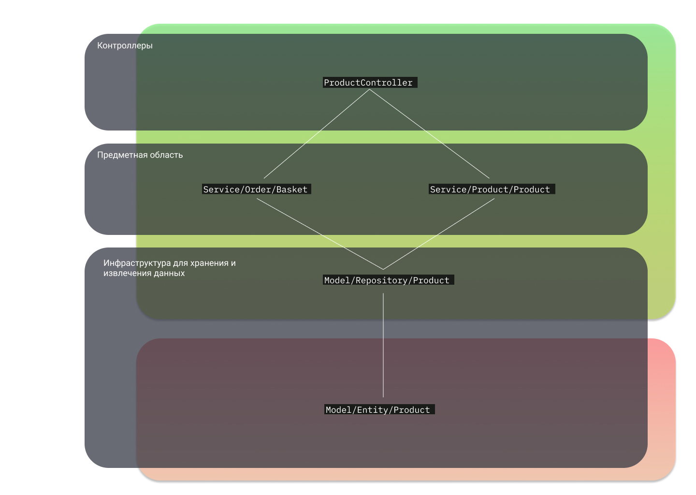

# Design Patterns GeekBrains

Содержание:
- [Домашнее задание #1](#домашнее-задание-№1)
- [Домашнее задание #2](#домашнее-задание-№2)
- [Домашнее задание #3](#домашнее-задание-№3)
  - [Спагетти код](#спагетти-код)
  - [Изобретение квадратного колеса](#изобретение-квадратного-колеса)

# Домашнее задание №1

# Домашнее задание №2

# Домашнее задание №3

## Спагетти код

Как-то вынужденно пришлось писать дурной код, чтобы он не выделялся из концепции легаси проекта, где все плагины
выглядели одинакого. 

Сейчас я понимаю, что мог сделать это немного получше, абстрагируясь от этой концепции при необходимости.

## Изобретение квадратного колеса

На старте программирования, я использовал не очень хорошее решение по реализации политики безопасности пользователей.
На тот момент были несколько библиотек, реализующих похожую концепцию, но делающих это лучше.

